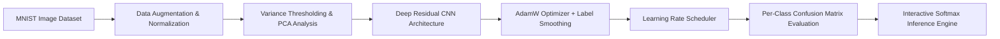

# CodeAlpha Task 3: Advanced Handwritten Character & Digit Recognition System

[](https://www.python.org/downloads/)
[](https://pytorch.org/)
[](https://pytorch.org/vision/)
[](https://scikit-learn.org/)

## Project Overview
This repository implements an end-to-end Deep Learning and Computer Vision system for handwritten digit and character recognition. The project demonstrates full-cycle computer vision development: spatial image augmentations, classical feature extraction (HOG / Edge Gradients), PCA dimensionality reduction, deep convolutional architecture with Batch Normalization and Dropout, learning rate scheduling with `ReduceLROnPlateau`, detailed per-class confusion matrix diagnostics, and an interactive inference visualizer.

---

## 🔬 System Architecture



### 1. Computer Vision Preprocessing & Augmentation
- **Spatial Transformations**: Random rotations (+-12 deg), Affine translations, scaling (0.95 to 1.05).
- **Pixel Normalization**: Channel-wise normalization (mean=0.1307, std=0.3081).

### 2. Feature Extraction & Dimensionality Reduction
- **Variance Thresholding**: Filtering low-entropy background pixels.
- **Principal Component Analysis (PCA)**: 2D/50D orthogonal projection explaining primary image variance.

### 3. Deep Convolutional Architecture
- Hierarchical feature extractors: 32 -> 64 -> 128 channels.
- Batch Normalization & LeakyReLU non-linear activations.
- Dropout2D & Dropout layers for regularization.
- Dense classification head with 10-class Softmax output.

### 4. Training Optimization & Diagnostics
- **Optimizer**: AdamW with Weight Decay (1e-4).
- **Loss Function**: Cross-Entropy Loss with Label Smoothing (0.05).
- **Scheduler**: `ReduceLROnPlateau` dynamic learning rate adjustment.
- **Metrics**: Per-class Precision, Recall, F1-Score, and Confusion Matrix Heatmap.

---

## 📁 Repository Structure
```
.
├── handwritten_character_recognition.ipynb   # Complete Step-by-Step Jupyter Notebook
├── mnist_sample_data.csv                     # Benchmark Pixel Feature Dataset
├── README.md                                 # Technical Documentation
└── .gitignore
```

---

## 🚀 Getting Started

### Prerequisites
Install the required dependencies:
```bash
pip install torch torchvision numpy pandas scikit-learn matplotlib seaborn
```

### Running the Notebook
Launch Jupyter Notebook to run all cells:
```bash
jupyter notebook handwritten_character_recognition.ipynb
```
